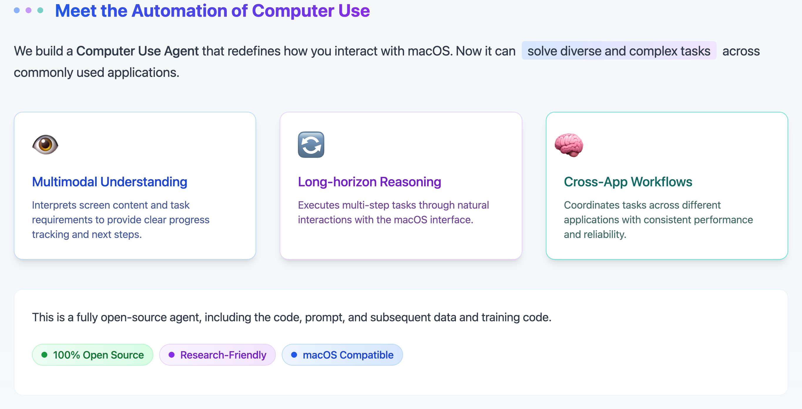

# MacOS Agent

A powerful automation agent for macOS that enables natural language control of various system applications and services. This agent allows you to interact with your Mac using simple text commands, automating tasks across multiple applications including Finder, TextEdit, Preview, and more.

[🌐 Project Page](https://computer-use-agents.github.io/macos/)

## Features

- **Natural Language Interface**: Control your Mac using simple text commands
- **Multi-Application Support**: Works with various macOS applications:
  - Browser automation
  - Calendar management
  - Excel operations
  - Finder navigation
  - QuickTime Player control
  - PowerPoint automation
  - Preview operations
  - TextEdit automation
  - WeChat integration
  - Word document handling
- **Playwright Integration**: Web automation capabilities
- **Accessibility Support**: Seamless integration with macOS accessibility features

## Installation & Usage

Please refer to the [Installation Guide](https://computer-use-agents.github.io/MacOS-Agent/#installation) for detailed instructions on how to install and configure the MacOS Agent.

## Contributing

Follow the instructions for [development guidelines](https://computer-use-agents.github.io/MacOS-Agent/#development-setup).

## Troubleshooting

### Common Issues

1. **Accessibility Permissions**: If automation fails, ensure your code editor has the necessary accessibility permissions
2. **Python Version**: Make sure you're using Python 3.11
3. **Dependencies**: If you encounter dependency issues, try running `uv sync` again

## License

This project is licensed under the [Creative Commons Attribution-NonCommercial 4.0 International License](https://creativecommons.org/licenses/by-nc/4.0/) (CC BY-NC 4.0).

This license allows you to:
- Share — copy and redistribute the material in any medium or format
- Adapt — remix, transform, and build upon the material

Under the following terms:
- Attribution — You must give appropriate credit, provide a link to the license, and indicate if changes were made
- NonCommercial — You may not use the material for commercial purposes

For more details, please see the [full license text](https://creativecommons.org/licenses/by-nc/4.0/legalcode).

## Support

For support, please open an issue in the GitHub repository or contact the maintainers.
