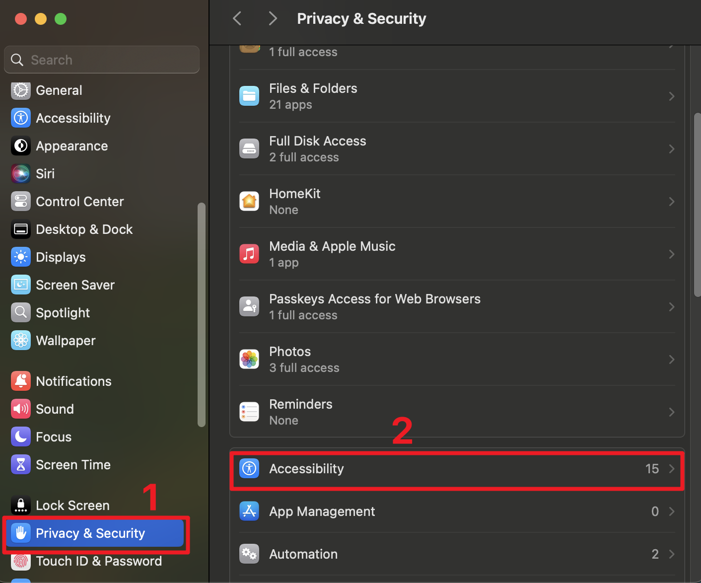
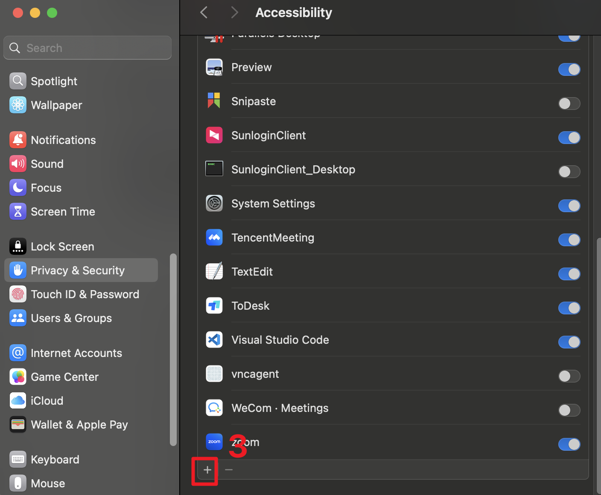
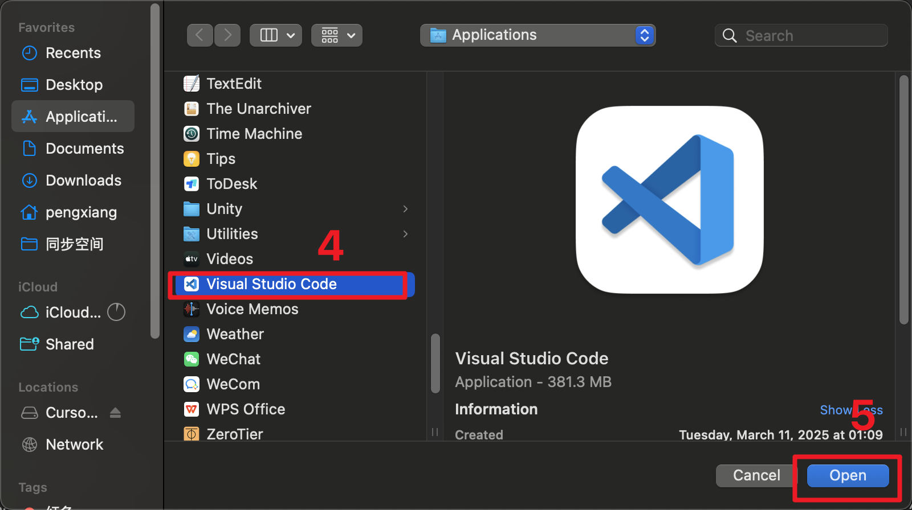

# MacOS Agent

A powerful automation agent for macOS that enables natural language control of various system applications and services. This agent allows you to interact with your Mac using simple text commands, automating tasks across multiple applications including Finder, TextEdit, Preview, and more.

## Features

- **Natural Language Interface**: Control your Mac using simple text commands
- **Multi-Application Support**: Works with various macOS applications:
  - Browser automation
  - Calendar management
  - Excel operations
  - Finder navigation
  - QuickTime Player control
  - PowerPoint automation
  - Preview operations
  - TextEdit automation
  - WeChat integration
  - Word document handling
- **Playwright Integration**: Web automation capabilities
- **Accessibility Support**: Seamless integration with macOS accessibility features

## Prerequisites

- **macOS**: This project is specifically designed for macOS systems
- **Python 3.11**: Required for running the agent
- **uv**: Fast Python package installer and resolver
- **Git**: For version control and repository management

## Installation

### 1. Install Python Dependencies

Follow the instructions in the [uv documentation](https://docs.astral.sh/uv/reference/cli/#uv) to install uv.

### 2. Clone and Setup the Repository

```bash
# Clone the repository
git clone https://github.com/yourusername/MacOS-Agent.git
cd MacOS-Agent

# Install project dependencies
uv sync
```

### 3. Install Playwright

```bash
# Install Playwright for web automation
npm init playwright@latest
```

### 4. Conassets Accessibility Permissions

To enable system automation, you need to grant accessibility permissions:

1. Open System Settings > Privacy & Security > Accessibility
2. Click the "+" button to add your code editor
3. Navigate to Applications and select your editor
4. Enable the permission by checking the box

<div style="display: flex; justify-content: space-between;">
    
    
    
</div>

## Usage

Run the agent with your desired command:

```bash
uv run main.py --prompt "Your task description here"
```

## Configuration

The project uses environment variables for configuration. Copy `.env.example` to `.env` and modify the settings as needed:

```bash
cp .env.example .env
```

## Contributing

We welcome contributions! Please follow these steps:

1. Fork the repository
2. Create a feature branch
3. Commit your changes
4. Push to the branch
5. Create a Pull Request

## Troubleshooting

### Common Issues

1. **Accessibility Permissions**: If automation fails, ensure your code editor has the necessary accessibility permissions
2. **Python Version**: Make sure you're using Python 3.11
3. **Dependencies**: If you encounter dependency issues, try running `uv sync` again

## License

This project is licensed under the [Creative Commons Attribution-NonCommercial 4.0 International License](https://creativecommons.org/licenses/by-nc/4.0/) (CC BY-NC 4.0).

This license allows you to:
- Share — copy and redistribute the material in any medium or format
- Adapt — remix, transform, and build upon the material

Under the following terms:
- Attribution — You must give appropriate credit, provide a link to the license, and indicate if changes were made
- NonCommercial — You may not use the material for commercial purposes

For more details, please see the [full license text](https://creativecommons.org/licenses/by-nc/4.0/legalcode).

## Support

For support, please open an issue in the GitHub repository or contact the maintainers.
