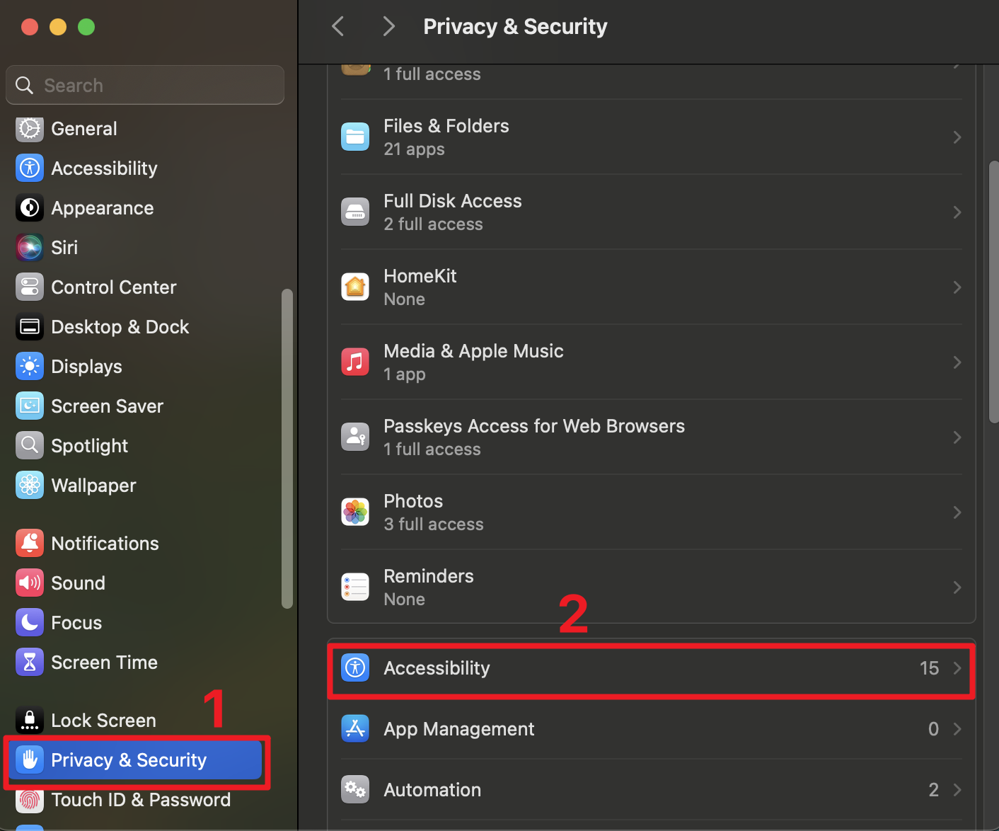
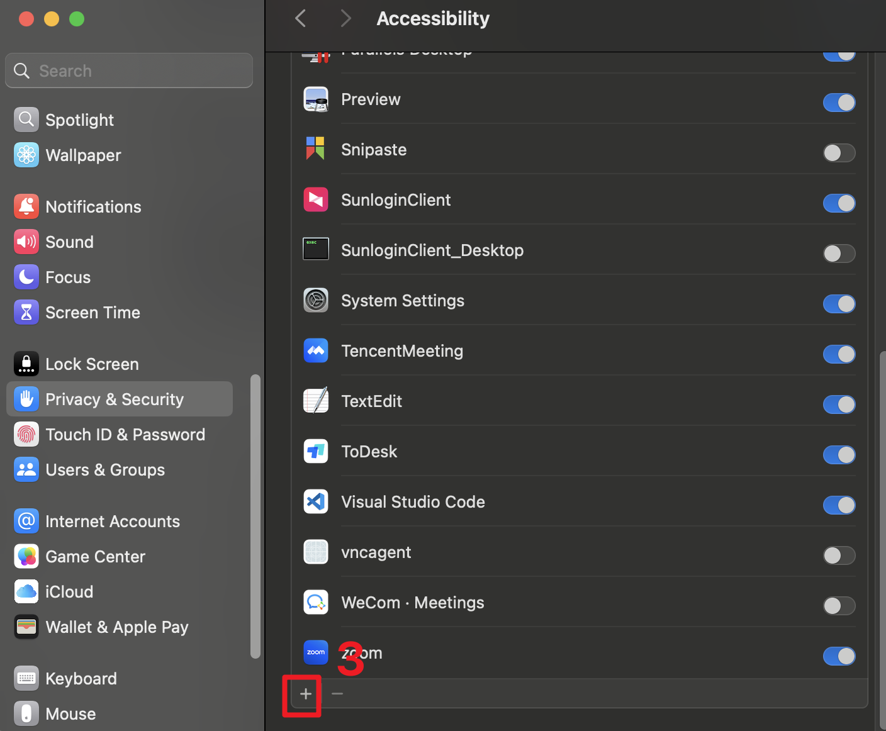

# MacOS Agent

This document provides instructions on how to set up, install dependencies for, and run the MacOS Agent using `uv`, the fast Python package installer and resolver.

## Prerequisites

*   **macOS**: This setup guide is specific to macOS.
*   **Python 3.11**: This project requires Python version 3.11. Ensure it's installed and accessible in your PATH. You can check your version with `python3 --version`. Consider using `pyenv` or the official Python installer for macOS.
*   **uv**: The `uv` tool is required for environment and package management.
*   **Git**: Needed to clone the repository (usually pre-installed on macOS or available via Xcode Command Line Tools).

## Installation

### Python Environment
Follow these steps to get the agent running on your Mac:

1.  **Install uv**:
    If you don't have `uv` installed, use one of the following methods:

    *   Using `curl`:
        ```bash
        curl -LsSf https://astral.sh/uv/install.sh | sh
        ```
    Verify the installation:
    ```bash
    uv --version
    ```

2.  **Clone the Repository**:
    Get the project code using Terminal:
    ```bash
    git clone <repository-url> # Replace <repository-url> with the actual URL
    cd MacOS-Agent             # Navigate into the project directory
    ```

3.  **Install Dependencies**:
    Use `uv` to install the required dependencies:
    ```bash
    uv sync
    ```
    This will install all dependencies specified in `pyproject.toml`, including:
    - Browser Agent
    - Calendar Agent 
    - Excel Agent
    - Finder Agent
    - Player Agent (QuickTime)
    - PowerPoint Agent
    - Preview Agent
    - TextEdit Agent
    - WeChat Agent
    - Word Agent

    The dependencies will be installed from their respective Git repositories as specified in the project configuration.

### Playwright

Playwright is a tool for automating web browsers. It is used to test and automate web browsers.


```bash
# use npm to install playwright
npm init playwright@latest
```

## Accessiblity Tree Premission

Grant accessibility permissions to your code editor (VSCode/Cursor) in macOS System Settings:

1. Open System Settings > Privacy & Security > Accessibility
2. Click the "+" button to add your editor
3. Navigate to Applications and select your editor
4. Enable the permission by checking the box

<div style="display: flex; justify-content: space-between;">
    
    
    
</div>

This allows your editor to interact with system UI elements required for automation.


## Run the Agent:
    
    Use `uv` to run the agent:

    ```bash
    uv run main.py --prompt <your task for macosagent>
    ```
