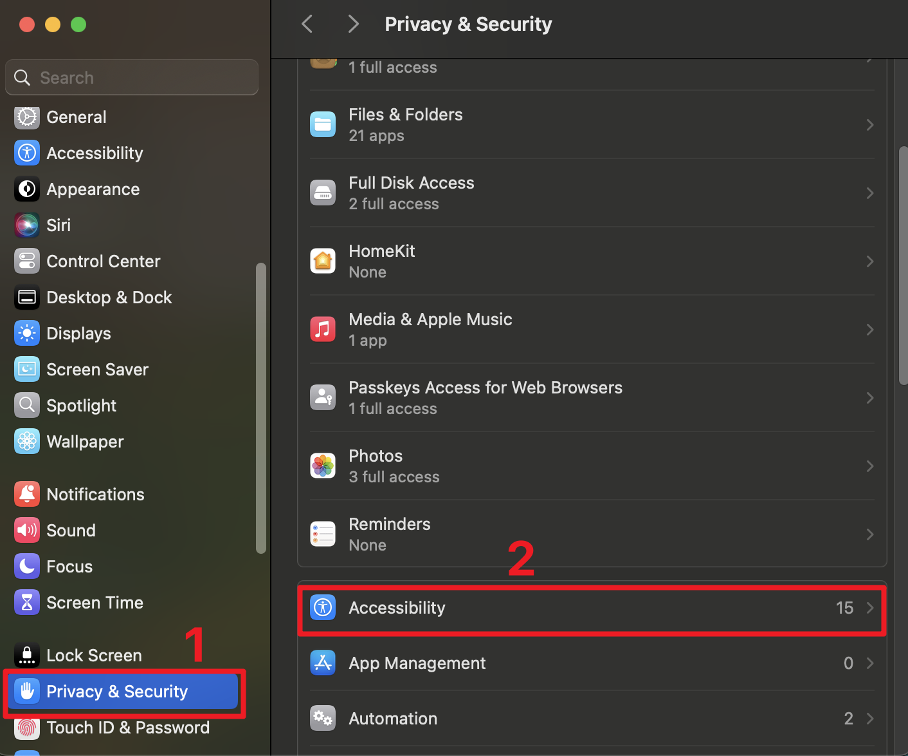
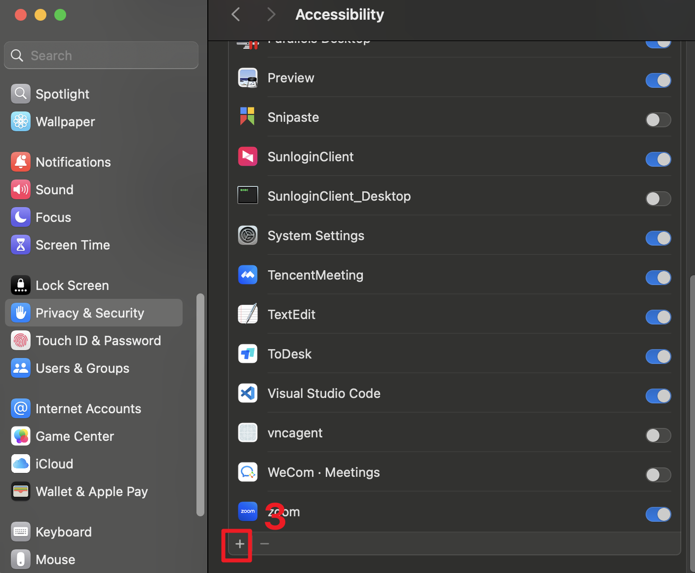

# MacOS Agent
## Installation

### 1. Install Python Dependencies

Follow the instructions in the [uv documentation](https://docs.astral.sh/uv/reference/cli/#uv) to install uv.

### 2. Clone and Setup the Repository

```bash
# Clone the repository
git clone https://github.com/yourusername/MacOS-Agent.git
cd MacOS-Agent

# Install project dependencies
uv sync
```

### 3. Install Playwright

```bash
# Install Playwright for web automation
npm init playwright@latest
```

### 4. Configure Accessibility Permissions

To enable system automation, you need to grant accessibility permissions:

1. Open System Settings > Privacy & Security > Accessibility
2. Click the "+" button to add your code editor
3. Navigate to Applications and select your editor
4. Enable the permission by checking the box

<div style="display: flex; justify-content: space-between;">
    
    
    
</div>

## Usage

### Executing the agent

use uv to run the agent
```bash
uv sync
uv run macosagent execute examples/tasks/task1.json
```
Checkout `examples/tasks/task1.json` for an example task. Below is an example task:
```json
{
  "task": "a task instruction'",
}
```


## Development Setup

### Pre-commit Hooks

This project uses pre-commit hooks to ensure code quality before each commit. The setup includes:

1. **ruff**: A fast Python linter and formatter
2. **pylint**: A comprehensive Python code analyzer

#### Configuration Files

- `.pre-commit-config.yaml`: Defines the pre-commit hooks and their configurations
- `ruff.toml`: Configures ruff linting rules
- `pylintrc`: Configures pylint analysis rules

#### Setup Process

1. Install pre-commit using uv:
   ```bash
   uv pip install pre-commit
   ```

2. Install the git hooks:
   ```bash
   pre-commit install
   ```

3. Run checks manually on all files:
   ```bash
   pre-commit run --all-files
   ```
4. When you do git commit, the pre-commit hooks will run automatically. If you want to skip the hooks, you can use `git commit --no-verify`.
#### Customization

- ruff is configured to auto